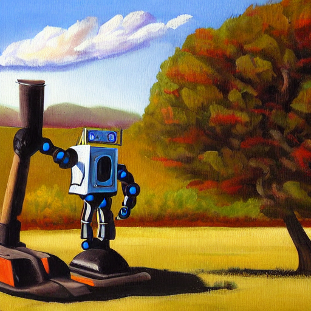

---

## 🖼️ Output Image
The image was generated using the above prompt.

---

## 📁 Files Included
- `Task02_ImageGeneration.ipynb` — Jupyter Notebook with all the code
- `robot_painting.png` — Image generated from the prompt
- `README.md` — This file

---

## 🧪 How to Run
1. Open the notebook in Google Colab.
2. Install required libraries (`diffusers`, `transformers`)
3. Run the prompt to generate your own image!
